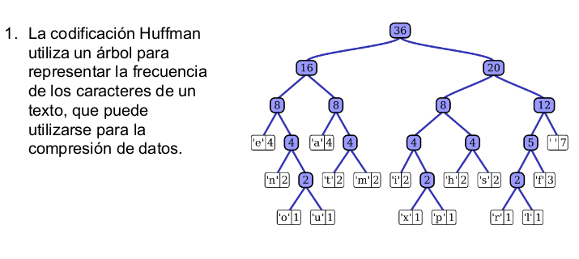

# estructura
proyecto estructura de datos
# Proyecto de Codificación de Huffman

## Resumen del proyecto
Este proyecto implementa el algoritmo de codificación de Huffman para comprimir y descomprimir archivos de texto. El algoritmo construye un árbol de Huffman basado en las frecuencias de los caracteres en el texto y utiliza ese árbol para generar códigos de longitud variable para cada carácter. Estos códigos se utilizan para comprimir el texto y luego se pueden utilizar para descomprimirlo y recuperar el texto original.

## Gráfica del proceso
A continuación se muestra una representación visual del proceso de codificación y decodificación de Huffman:

## Instalación
1. Clona este repositorio en tu máquina local utilizando el siguiente comando:
https://github.com/jalexis10/estructura/blob/main/Untitled-1.py
2. Asegúrate de tener Python 3 instalado en tu sistema.

3. Instala las dependencias del proyecto ejecutando el siguiente comando:

pip install -r requirements.txt

markdown
Copy code

## Uso
1. Comprimir un archivo de texto:
- Ejecuta el archivo `main.py` desde la línea de comandos.
- Se abrirá un cuadro de diálogo para seleccionar el archivo de texto a comprimir.
- Una vez seleccionado el archivo, se generará un archivo comprimido con el mismo nombre y el sufijo `_comprimido.txt`.

2. Descomprimir un archivo comprimido:
- Ejecuta el archivo `main.py` desde la línea de comandos.
- Se abrirá un cuadro de diálogo para seleccionar el archivo comprimido a descomprimir.
- Una vez seleccionado el archivo, se generará un archivo descomprimido con el mismo nombre y el sufijo `_descomprimido.txt`.

## Referencias
- Librería `heapq` de Python: [Documentación oficial](https://docs.python.org/3/library/heapq.html)
- Librería `tkinter` de Python: [Documentación oficial](https://docs.python.
